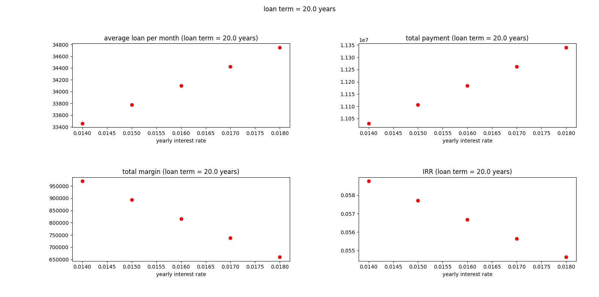

# Buy a house or rent and invest?

You can play around with the Colab notebook: https://colab.research.google.com/drive/1PyYj1XR7fEAQDsdtEufLjS522t6CbJbR?usp=sharing

The purpose of this repo is to see if we don't buy but rent a house, how large the
Internal Rate of Return (IRR) should be if we use the budget to invest to match the
margin of buying a house after the loan term.

Here we just assume a simple scenario: no leverage and no other investment if we
buy a house.

There are several factors to influence the target IRR:
- the interest rate
- the loan term
- the proportions of down payment
- the ratio of house prices after/before the loan term
- the payment method (Equal Total Payment or Equal Principal Payment)
- the rent if we don't buy but rent a house

Please refer to `run.sh` and `buy_vs_rent_and_invest`.

## how to use the script/code?

### Installation
`pip3 install argparse matplotlib numpy`

### Run the script
Change the hyperparameters in `run.sh` then `bash run.sh`.
Some plots will pop up showing the results.

## Examples

We can see if the yearly interest rate is 1.6%, we have to pay about $34000/month
for a $10000000 house if the down payment is 30%. The total payment during the 20-year loan term is about
$11200000. If the house is $12000000 after 20 years, the margin will be $800000.
If we don't buy the house and the rent is $30000, the investment IRR should be at least
about 5.7% to match the margin of buying a house.

