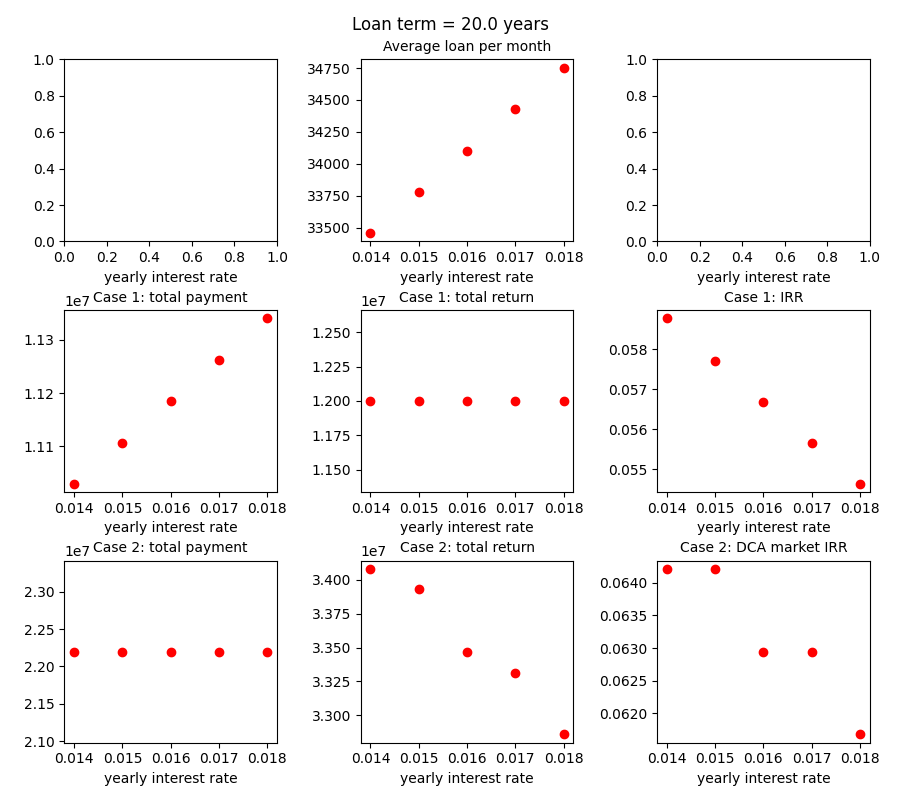

# Buy a house or rent and invest?

You can play around with the Colab notebook: https://colab.research.google.com/drive/1PyYj1XR7fEAQDsdtEufLjS522t6CbJbR?usp=sharing

The purpose of this repo is to see if we don't buy but rent a house, how large the
Internal Rate of Return (IRR) should be if we use the budget to invest to match the
margin of buying a house after the loan term.

Here we just assume a simple scenario: no leverage.

## A realistic scenario: Dollar Cost Averaging (DCA) investment

Furthermore, we analyze a realistic scenario where we have a fixed monthly budget 
and use the Dollar Cost Averaging (DCA) strategy to invest. 
The monthly budget has to run out in a month and can only be used to pay the 
loan/rent and invest.
That is, after we pay the loan or rent, all of the rest of budget is used to
invest in every month.
In this scenario, we calculate how large the overall market IRR should be for
"rent and invest" to beat the total return of "buy and invest".

## Factors

There are several factors to influence the target IRR:
- the interest rate
- the loan term
- the proportions of down payment
- the ratio of house prices after/before the loan term
- the payment method (Equal Total Payment or Equal Principal Payment)
- the rent if we don't buy but rent a house
- the monthly budget used to pay the loan/rent and invest

Please refer to `run.sh` and `buy_vs_rent_and_invest`.

## how to use the script/code?

### Installation
`pip3 install argparse matplotlib numpy`

### Run the script
Change the hyperparameters in `run.sh` then `bash run.sh`.
Some plots will pop up showing the results.

## Examples

We can see if the yearly interest rate is 1.6%, we have to pay about $34000/month
for a $10000000 house if the down payment is 30% with the loan term 20 years. The 
total payment during the loan term will be about $11200000.
We suppose the house price will be $12000000 after 20 years.

### Case 1:
If we don't buy the house and the rent is $30000, the investment IRR should be at 
least about 5.7% to match the margin of buying a house.

### Case 2:
Suppose we have a fixed $80000 monthly budget and we apply a DCA investment
strategy.
If we buy the house, we still have about $46000 a month to invest after paying
the loan.
If we don't buy the house and the rent is $30000, we have $3000000 (equal to the 
down payment) to invest initially, and have $50000 a month to invest after paying 
the rent. In this case, the overall market IRR should be at least about 6.3% to 
match the return of buying a house.

